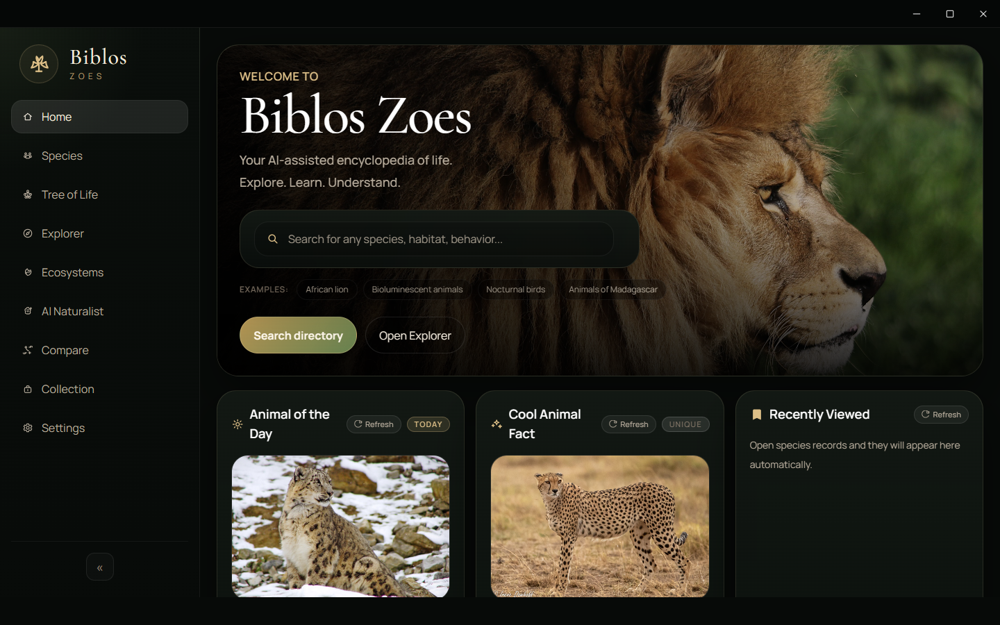

<h1 style="font-family: Arial, sans-serif; font-size: 36px; color: #4F46E5; display: flex; align-items: center; gap: 12px; border-bottom: 3px solid #4F46E5; padding-bottom: 8px;">
  Biblos — Interactive Biodiversity Explorer
</h1>

Biblos is a Tauri desktop application for exploring species, ecosystems, taxonomy, and natural-history media. It combines curated local data with optional live species services and interactive visual tools.

---

## Tech Used


---

## Features

- Explore curated species, ecosystems, and the tree of life
- Species search, detailed profiles, classification tree, and comparison view
- Personal collections and folders
- Optional live data and media services, including GBIF, iNaturalist, Wikipedia, and YouTube
- AI Naturalist workspace and natural-language species tooling
- 3D species viewer powered by React Three Fiber and Drei
- Image drop area and local background-removal capability
- Rust index-seeding command for local data setup

---

## Screenshots



**Home:** Search the life directory, jump into the explorer, and browse a daily animal, animal fact, and recently viewed species.

---

## Project Structure

```text
src/
|-- assets/                 # Brand graphics
|-- components/             # Search, species, taxonomy, collection, and modal UI
|-- data/                   # Curated animals, discovery, ecosystems, tree-of-life data
|-- pages/                  # Explorer, species, ecosystems, compare, collection, settings
|-- services/               # Live data, media, cache, AI, and search services
|-- hooks/                  # Species-media hooks
|-- App.tsx                 # Main application and routes
`-- main.tsx                # React entry point

src-tauri/
|-- src/                    # Tauri backend and seed binary
|-- tauri.conf.json         # Desktop window and bundle configuration
`-- Cargo.toml              # Rust dependencies
```

---

## Getting Started

### Prerequisites

- Node.js 18+
- npm
- Rust toolchain
- Tauri system dependencies for your operating system

### Install and run

```bash
npm install
npm run tauri dev
```

For frontend-only development:

```bash
npm run dev
```

The Vite server is configured for `http://localhost:8668`.

---

## Available Scripts

```bash
npm run dev          # Start Vite
npm run build        # Type-check and build frontend assets
npm run preview      # Preview the production frontend build
npm run tauri dev    # Run the desktop app
npm run seed:index   # Run the Biblos Rust index seeder
```
